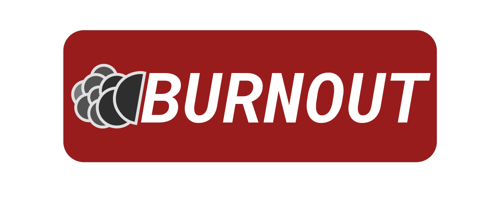

### Burnout
Project for CS340 Fall 2023

### Project Name: 
Burnout

### Project Description: 

    

**THE ULTIMATE MOTORSPORTS APP** designed to *revolutionize* the way that fans get their motorsport data. Racemob is a comprehensive aggregator of motorsports data, seamlessly bringing together information from various racing series, 
including Formula 1, NASCAR, MotoGP, IndyCar, and more. This user-friendly app provides a one-stop-shop for all things motorsports, offering an immersive and personalized experience for fans of high-octane excitement.

**Key Features:**
- Up-to-Date Race Schedules
- The Latest Points Standings
- Driver and Team profiles
- State-of-the-Art Interface

We hope that this app displays our commitment to giving you the greatest motorsports experience possible. Whether you are a longtime-fan or a newcomer. We guarantee you will enjoy our cutting-edge, comprehensive, racing coverage
in our all-in-one-app.

### Group Members & GitHub ID's:
- Nicholas Lindsey - nryanl
- Aaron King - aaronpig9
- Cody Allen - calle102
- Caleb Kornegay - CalebKornegay
- Connor Gannaway - connorgannaway
- Peyton Davis - peytonad
- Andrew Lindstrom - aglindstrom

### Group Size
 This group is full.

## Project Documentation

#### Requirements
- A computer running MacOS, Windows, or Linux.
- A smartphone running iOS or Android for running the app using Expo Go.

### Installation Steps (Frontend)
1. **Install Node.js and npm**: Download and install Node.js (which includes npm) from [https://nodejs.org/en/](https://nodejs.org/en/). If you are on Linux, you can install the nodejs and npm as packages.
If you encounter any issues, make sure you have Python, NodeJS and jdk8 installed in your system if not, install them.

2. **Install React Native CLI**: Open a terminal and run `npm install -g react-native-cli`.

3. **Clone the GitHub Repository**:
   - Use `git clone https://github.com/utk-cs340-fall23/RaceMob.git` to clone the repository to your machine.

4. **Navigate to the Project Directory**: 
   - After cloning, navigate to this directory: `RaceMob/app/frontend/burnout`.

5. **Install Dependencies**: Run `npm install` to install all the required dependencies listed in the `package.json` file. You may need to install yarn, which you can do by running `npm install yarn`.

6. **Expo Go Installation**:
   - For iOS: Download the “Expo Go” app from the Apple App Store.
   - For Android: Download the “Expo Go” app from the Google Play Store.

7. **Start the React Native Server**: Run `npx expo start` in the project directory. This will start the Metro Bundler.

#### Running the App on Your Phone
1. **Make Sure Your Phone and Computer Are On The Same Network**: This is necessary for the Expo Go app to access the React Native server running on your computer.

2. **Open Expo Go on Your Smartphone**: Once opened, you will see an option to scan a QR code. If on iPhone, open the camera app instead.

3. **Scan the QR Code with Expo Go**:
   - A QR code will appear in the terminal or command prompt where you started the React Native server.
   - Scan this QR code using the Expo Go app.

4. **Open the Project in Expo Go**:
   - After scanning, the app should start building on your phone. 

5. **View the App**: Once the build is complete, the app should automatically open on your phone. If not, you should be able to manually open it from a list of apps on Expo Go's home page.

#### How to Use the App
1. While on the Home Page, changing the date with the calendar in the top right will change the recent races displayed on the Home Page to show the most recent centered around the selected date. 

2. Changing pages is easy, either clicking a card on the page will navigate to a page with more details, or changing the tab at the bottom of the screen will change to the Home Tab, Leagues Tab, or Settings Tab. Changing pages and then changing tabs, if the user decides to go back to the previous tab the page they were on will be saved. 

3. On the Leagues Tab, the first page will be the Leagues Page. This is the page where you can select between F1, NASCAR, etc. Since currently the only league with data on the app is F1, the other pages are blank. However, clicking on the Formula 1 card will take you to the Formula 1 page. On this page you will see the most recent race and the top three finishers as well as a table that lists the teams in order of their points and the drivers in order of points. Clicking on any of the teams or drivers will take you to their respective screens.

4. Team and Driver screens will show that specific team or drivers data. For Teams it will show you that teams data for all previous seasons that team has competed, as well as the drivers for this current season. If you click on the driver's card for that team it will take you to that driver's page where that drivers data will be displayed for this season as well as every previous season that driver has competed.

#### Important Notice
To run and use the app, this is all that is needed to be done. The app is configured to use our current staging API hosted at `https://pitwall.connorgannaway.net`.  If there are issues with the app loading, check the [Network Status](https://status.connorgannaway.net). To run your own backend server, follow the instructions below.

### Installation Steps (Backend)
1. **Install Python**: Install Python >= 3.10 from https://www.python.org.
2. **Create a virtual environment**:
   - Navigate to `RaceMob/app/backend`.
   - Run the command `python -m venv venv`. This will create a virtual envirionment using Python's venv package called venv.
   - Activate this virtual environment by running `.\venv\Scripts\activate` on Windows or `. venv/bin/activate` on Linux.
3. **Install Packages**: To install necessary backend packages, run `pip install -r requirements.txt`.
4. **Setup Database**: This step is NOT NECESSARY if you are using the included sqlite3 file. For ease of use, we've included the development database to help mitigate errors in importing data.
   - Run `python manage.py migrate`. This will create the database and tables.
   - Import data from `Racemob/app/backend/csv`. The preferred tool for this is [DataGrip](https://www.jetbrains.com/datagrip/)
5. **Run the Backend Server**: Run the server using `python manage.py runserver`

### API Endpoints
The following endpoints are accessible when running your local backend server or at the [Staging API](https://pitwall.connorgannaway.net/version).

A note: Endpoints are returned as html, with styling for viewing on the web. adding the query parameter `?format=json` to any endpoint will cause it to return the raw json response. This is what is used in the application.

- `verson/`: Returns API version information.
- `v1/messages/`: Returns any enabled application messages, run with `?all=true` to return all messages
- `v1/messages/<pk>/`: Returns a specific message
- `v1/races/nearest/`: Returns a list of previous, ongoing, and upcoming race ids based off the current date. Takes an optional date parameter
- `v1/races/<pk>/`: Returns all details about a race.
- `v1/races/<pk>/brief/`: Returns brief information about a race.
- `v1/drivers/`: Returns a list of all drivers.
- `v1/drivers/<pk>/`: Returns information about a driver and their past performances
- `v1/teams/`: Returns a list of teams in the current season. Takes an optional year parameter.
- `v1/teams/<pk>/`: Returns information about a specific team and their previous performances.
- `v1/leagues/`: Returns a list of all leagues.
- `v1/leagues/<pk>/`: Returns information about the races and standings in a league's current season. Takes an optional year parameter.

### License
View [License.txt](https://github.com/utk-cs340-fall23/RaceMob/blob/main/License.txt) for more information.
